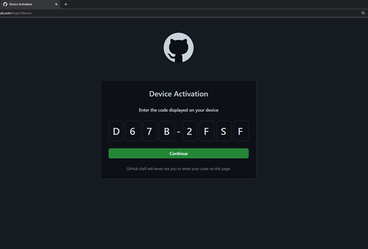
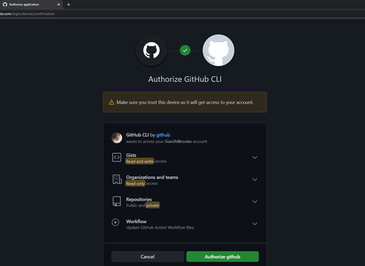
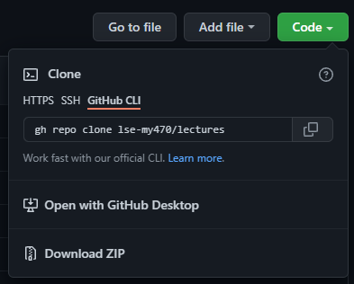

# GitHub: Command Line Interface

In August 2021, GitHub rolled out it's own command line interface (CLI) that can be used in any terminal or command line.  
When we use GitHub CLI, we use ```gh``` instead of ```git``` **for some, but not all processes**. You still need to use ```git``` for updating and some other bits we will go over.
GitHub CLI brings pull requests, issues, and other GitHub concepts to the terminal next to where you are already working with git and your code. 
In this guide, we will focus on installing GitHub CLI and Git using Anaconda Prompt, as the steps you need to this will be the same across all machines. 

### You can just download/upload assignments and lectures throughout the course. You will not loose marks for this.

To open Anaconda Prompt (anaconda3), simply search for it as you would any other program using the Windows Menu or Spotlight on Mac.

If you're cloning (downloading) GitHub repositories using HTTPS, you can use GitHub CLI. 
This means that when we are cloning a repo we need to use the "HTTPS" option as shown below, if we are not using the GitHub CLI shortcut (more on this later).


What we will go over in this tutorial is the basics needed for the course, with additional resources provided at the end.

1. Getting Started with GitHub CLI
2. Accessing Lectures
3. Working on Assignments

## Getting Started with Git and GitHub CLI
The steps needed to clone a repo using HTTPS, is outlined in the next section, but first we need to download and install Git and the CLI tools, as well as let GitHub know who we are.

If you are interested in other methods of installing GitHub CLI, [more information can be found on the Installation page of the CLI repo](https://github.com/cli/cli#installation)

**Step 1: Download and Install Git**

Open Anaconda Prompt and copy and paste (left click) or type the line below into the terminal. Press return/enter.
```
conda install -c anaconda git
```
After a few seconds you will be asked if you wish to proceed with installing ```git```. Type ```y``` and press enter to install. 

**Step 2: Download and Install GitHub CLI**

Copy and paste (left click) or type the line below into the prompt, don't worry if you need to open a new window as this won't matter. Press return/enter.
```
conda install gh --channel conda-forge	
```
After a few seconds you will be asked if you wish to proceed with installing ```gh```. Type ```y``` and press enter. 

*NOTE:* If you need to update GitHub CLI use ```conda update gh --channel conda-forge``` and for git ```conda update git --channel conda-forge```


**Step 3: Configuring GitHub CLI**

When the install is finished, we can begin setting up GitHub CLI to work on our computer. Don’t worry if you’ve closed the Anaconda Prompt, just open in again and carry on with these steps – you don’t need to install again. 

Still in the Anaconda Prompt, type ``` gh auth login``` and press enter. You will now be presented with a series of questions to set up GitHub CLI on your computer, as shown below.

```
(base) C:\Users\BrookeSJ> gh auth login

? What account do you want to log into?  [Use arrows to move, type to filter]
> GitHub.com
  GitHub Enterprise Server
```
We can use the cursor (```>```) to select the option that we want. We will use GitHub.com, so we can just press enter to select this. Next, we will be asked what our preferred protocol is, meaning the set of rules, conventions, and data structures that dictate how devices exchange data across networks. Again, the option we want (HTTPS) is already selected, so we can just press enter.

```
? What is your preferred protocol for Git operations?  [Use arrows to move, type to filter]
> HTTPS
  SSH
```
You will be asked if you would like to authenticate Git with your GitHub credentials. Type ```Y``` and press enter.

```
? Authenticate Git with your GitHub credentials? (Y/n)
```
You will then choose how you would like to authenticate (log in with) GitHub CLI. The easiest way is with the web browser option. To choose this, just press enter.
```
? How would you like to authenticate GitHub CLI?  [Use arrows to move, type to filter]
> Login with a web browser
  Paste an authentication token
```
You will then be shown the massage below. Follow the instructions and copy to code. You then to enter. you may need to press it twice before a GitHub “device activation” window opens in your browser.
```
! First copy your one-time code: D67B-2FSF
- Press Enter to open github.com in your browser...
```
If you can’t copy the one-time code, you can just type it in the GitHub device activation window directly (but remember to use caps).




You will then be asked to authorise the application.
 
Click the “Authorize GitHub” button and then enter your password. Note that if you are prompted to log into you GitHub account, then do so. You will then be shown a screen that says “Congratulations, you're all set!” and confirms that your device is now connected to GitHub. 



Returning to your Anaconda Prompt window, you should now see a message that confirms you are logged in. Note that the output will display your own username.
```
- gh config set -h github.com git_protocol https
✓ Configured git protocol
✓ Logged in as SianJMBrooke
```
To check GitHub CLI has been installed successfully, you can type ```gh``` in Anaconda prompt to see information on usage and commands. You can do this at any point to see what you can do with GitHub CLI.

## 2. Accessing Lectures
**OR Cloning a Existing Repository**

Cloning a repository pulls down a full copy of all the repository data that GitHub has at that point in time, including all versions of every file and folder for the project. At any point, you can push your changes (upload) to the remote repository on GitHub, or pull other people's changes (download) from GitHub. With GitHub CLI, the workflow for cloning a repo is a lot simpler than using Git on the command line or terminal. 

I will use the example of the [MY470 lectures](https://github.com/lse-my470/lectures) on the Anaconda Prompt, but this workflow works with any repo you have access too.

On GitHub, navigate to the main page of the repository. Above the list of files, click "⬇️ Code".

This first option is the same as with the command line, copying the HTTPS url from the code menu shown below by clicking 📋. 


Open Anaconda Prompt change the current working directory (i.e. the folder where you are, 
indicated by the filepath ```C:\Users\BrookeSJ>```) to the location where you want the cloned (lectures) directory. You can do this using the commands below.

```
#  Use “cd” to change your current directory to the destination specified within the command. So to go to the "Documents" folder
# within the current directory (C:\Users\BrookeSJ).
cd Documents

# You can also navigate directly to a sub-directory in one go. My sub-directory is called "MY470" which is the course code.
cd Users\BrookeSJ\Documents\Teaching\MY470

# If your file path has a space in it, wrap the file path in quotes.
cd "Users\BrookeSJ\Documents\Teaching\MY 470"
```
To clone (download) the lecture repo type```gh repo clone```, and then paste the URL you copied earlier. Then press Enter to create your local clone in the location you chose.

``` bash
gh repo clone https://github.com/lse-my470/lectures.git
```
You can also just use the GitHub CLI code provided directly in the menu, instead of HTTPS. 



Here, we copy the code using 📋 and paste it directly into Anaconda Prompt, with no other code needed.

```
gh repo clone lse-my470/lectures
```
Which ever method you choose, you will see a output that looks something like:
```
Cloning into 'lectures'...
remote: Enumerating objects: 1398, done.
remote: Counting objects: 100% (119/119), done.
remote: Compressing objects: 100% (100/100), done.
remote: Total 1398 (delta 56), reused 54 (delta 19), pack-reused 1279Receiving objects:  97% (1357/1398), 55.73 MiB | 3.Receiving objects:  98% (1371/1398), 55.73 MiB |
Receiving objects: 100% (1398/1398), 57.33 MiB | 3.30 MiB/s, done.
Resolving deltas: 100% (720/720), done.
```

That's it! All of the lecture files are now available on your personal computer.

### Updating Lecture Materials
So cloning is how you get a local copy of an existing repository to work on. It's usually only used once for a given repository, unless we want to have multiple working copies of it around. (Or want to get a clean copy after messing up your local one...). We will use ```gh``` for cloning.

Pulling (or fetching + merging) is how you update that local copy with **only new commits** from the remote repository. If you are collaborating with others, it is a command that you will run frequently. We will use ```git``` for this.

Using the code below, we can update the lectures in our local repo (on our computer). Note that we need to use the HTTPs with git, and not GitHub CLI. ```fetch``` will update your copy of files with updated ones from the repo, but will not overwrite the changes we make locally, such as notes on class files.

```
git fetch https://github.com/lse-my470/lectures.git
```
Producing the output:
```
remote: Enumerating objects: 1403, done.
remote: Counting objects: 100% (124/124), done.
remote: Compressing objects: 100% (105/105), done.
Remote: Total 1403 (delta 59), reused 54 (delta 19), pack-reused 1279
Receiving objects: 100% (1403/1403), 57.34 MiB | 2.74 MiB/s, done.
Resolving deltas:  51% (369/723)
Resolving deltas: 100% (723/723), done.
From https://github.com/lse-my470/lectures
 * branch            HEAD       -> FETCH_HEAD
```
These files should now be copied to your local directory (folder). You can read more on ```git fetch ``` [here](https://www.atlassian.com/git/tutorials/syncing/git-fetch).

## 3. Working on Assignments
Each week you will receive a email that provides you with a GitHub Classroom link. When you click on this link you will be directed to a page to accept the assignment 
and create your repo with your GitHub name (i.e. assignment-1-SianJMBrooke) in the [MY470 Organisation](https://github.com/lse-my470). In this repo will be your own copy of the assignment to work with, answer, and submit.

**Step 1: Downloading your assignment**

To download content from your assignment remote repo, we can use the ```git pull``` command. 
The ```git pull``` command is different to ```git fetch```as it immediately update the local repository to match that content. 
The ```git pull``` command is actually a combination of two other commands, ```git fetch``` followed by ```git merge```. You can read more [here](https://www.atlassian.com/git/tutorials/using-branches/git-merge).

First, navigate to the folder you want to save the assignment repo into. If you want to create a folder in the prompt, rather than navigating to one that already exists, you can use ``` mkdir``` followed by the name of the folder, such as ```mkdir assignment-1```. You can also use ```ls``` to list all the files and folders in the current directory (folder).

```
# Moving the folder we want our assignment in
cd C:\Users\BrookeSJ\Documents\Teaching\2021-2022\MY470\GitHub\assignment-1
```
You then need to initialise, Git creates a hidden directory called ". git". That directory stores all of the objects and refs that Git uses and creates as a part of your project's history. ```git init``` is one way to start a new project with Git. To start a repository, use either ```git init``` or ```git clone``` - not both.

If you have used ```git init``` you can then use ```git pull``` to copy your assignment repo.
```
# Initialize
git init
```
Output is:
```
Initialized empty Git repository in C:\Users\BrookeSJ\Documents\Teaching\2021-2022\MY470\GitHub\assignment-1\.git\
```
Using the HTTPs for the repo (in the same manner as with the lectures repo, in the Code menu) we can pull a copy of the assignment onto our local machine.
```
# Pull from assignment repo
git pull https://github.com/lse-my470/assignment-1-SianJMBrooke.git

```
Output:
```
remote: Enumerating objects: 5, done.
remote: Counting objects: 100% (5/5), done.
remote: Compressing objects: 100% (4/4), done.
remote: Total 5 (delta 0), reused 2 (delta 0), pack-reused 0
Unpacking objects: 100% (5/5), 1.95 KiB | 60.00 KiB/s, done.
From https://github.com/lse-my470/assignment-1-SianJMBrooke
 * branch            HEAD       -> FETCH_HEAD
```
You now have a copy of your assignment on your computer, ready to work with.

**Step 2: Submitting your assignment**

To submit our assignment we use ```git push```, which uploads you local repo (work) content to the remote repo on GitHub to be marked. u Pushing has the potential to overwrite changes, caution should be taken when pushing when working in teams. 

After working with files, you can use the ```git status``` command in your assignment repo to see which files git knows exist.

```
# Check the status of files in the repo
git status
```
Output 
```
On branch master
Untracked files:
  (use "git add <file>..." to include in what will be committed)
        MY470_wk1_assign.ipynb/

nothing added to commit but untracked files present (use "git add" to track)
```

The output here tells us exactly what we need to do to make sure these files are tracked by git and uploaded to the repo - we need to use ```git add```. Rather than listing each file individually we can use "```.```" to mean "track all of these files", as shown below.
```
git add .
```
When you are ready you can ```commit``` you changes, ready to upload them to GitHub. When committing, it is good practise to include a message with the commit that will show up on your repo page. You can do this, as illustrated below, using the "```-m```" flag.

```
git commit -m "Submitting assignment"
```
You will then get a output that shows these changes are staged, ready to be pushed.
```
[master 58eb03b] submit
 1 files changed, 0 insertion(+)
 create mode 160000 MY470_wk1_assign.ipynb
 ```
Finally, we can use ```git push``` to upload our assignment to GitHub to be marked, ensuring that we specify the where we are pushing too.
```
git push 
```
Output:
```
Enumerating objects: 4, done.
Counting objects: 100% (4/4), done.
Delta compression using up to 8 threads
Compressing objects: 100% (2/2), done.
Writing objects: 100% (3/3), 304 bytes | 304.00 KiB/s, done.
Total 3 (delta 1), reused 0 (delta 0), pack-reused 0
remote: Resolving deltas: 100% (1/1), completed with 1 local object.
To https://github.com/lse-my470/assignment-1-SianJMBrooke.git
   11bbee1..58eb03b  master -> master
```
The final step, is to open up GitHub in your browser and check you can see the files on the repo, ready to be marked. REMEMBER, if you can't see them, neither can we!
