# Three Ways to Use GitHub: Command Line
This document lays out the main ways that GitHub can be used.

This guide covers everything you need to know to interact with GitHub. **You can skip to the relevant section if you are stuck with a particular task.** Section 5 is advanced difficulty, intended to show you what is possible when working with GitHUb. The topics covered in this document are:

1. Command Line / Terminal: Intro and Syntax
2. Cloning a existing repository
3. Working from your local (personal) computer
4. Creating a repo on GitHub
5. Working with branches (Advanced Difficulty)

These guides are brief, focusing on getting started with each way of using the platform. The three approaches are listed in order of complexity, starting with the **web interface**, then to **GitKracken**, and finally to the **command line**. 
GitKracken is a Git Graphic User Interface (GUI) for Widows, Mac, and Linux. Students can get the Pro-licence for free through the GitHub Students Developer Pack.
While there are some great Git GUIs (like GitKracken) I think it's easier to learn git using Git-specific commands first and then to try out a git GUI once you're more comfortable with the commands.

## 1. Command Line
The very first thing you need to do if you are using GitHub from the command (cmd) line is to install Git. Even if it’s already installed, it’s probably a good idea to update to the latest version. The link below 
ains all the information you need to install Git on Windows, Mac, and Linux.

Install Git: https://git-scm.com/book/en/v2/Getting-Started-Installing-Git

**TIP:** When the Git installer prompts you "Select Components", ensure that *Windows Explorer Integration* is selected, along with Git Bash Here and Git GUI Here. This will allow you to use the context menu to open Git Bash in a specific location, without having to navigate to the directory your repository is in every time.

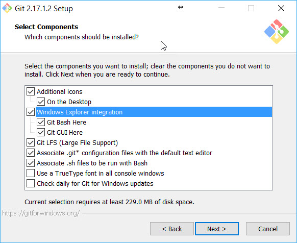

Windows Explorer Intergration is selected by default, so don't panic if you have already installed Git! If you un-selected this option, or it is not appearing on your context menu, the simpliest solution is to re-download and re-install Git making sure this option is selected. 

Note: Git for Windows comes with its own command prompt (Git Bash) that, besides git commands, has some useful Unix commands (and it looks better than the Windows default prompt).

**Make sure you have setup a GitHub account before advancing to the next stage of this walkthrough**

The general workflow of GitHub is represented in the diagram below. The black arrows are the commands that can be directly inputted into a console

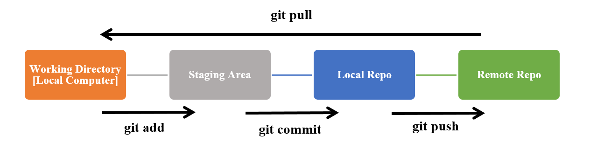

For instructions on commit messages, refer to *Commit_Message_Guidelines.md*

If you are having trouble installing git on Mac visit this website: https://git-scm.com/download/mac

```
# First try running the command below in terminal
$ brew install git

# If this does not work, try running the command below in your terminal.
# If you a prompted for a password, enter the password you use to log into you account (no password will appear on screen)
# Press enter (return) when you have entered your password, and again when prompted by the intaller.
$ /bin/bash -c "$(curl -fsSL https://raw.githubusercontent.com/Homebrew/install/master/install.sh)"

# Once the install has finished, trying running the git install command again (below).
$ brew install git
```

If you are still having problems, please email me (s.j.brooke@lse.ac.uk). It will be helpful if you can include a screen shot of the issue you are having.

### Introduction to Command Line
To use Git we'll be using the terminal. If you’re not familiar with using the cmd line, some basic commands for navigating the file system are below. 

```
#  Use “cd” to change your current directory to the destination specified within the command. So to go to the "Users" folder.
cd Users

# You can navigate directly to the sub-directory. My sub-directory is called "GitHub_SDS" which stands for Social Data Science.
cd Users\Sian\Documents\GitHub_SDS

# If your file path has a space in it, wrap the file path in quotes.
cd "C:\Users\Sian\Documents\GitHub SDS"
```
Another command that you may find in need is mkdir. This command creates a new directory with the specified name. The following command, for example, will create a new directory named *GitHub_Tutorials*.
```
# Create a file using "mkdir"
mkdir GitHub_Tutorials

# Create multiple folders at once
mkdir GitHub_Tutorials Python_Tutorials R_Tutorials
```
One of the most frequent commands is List Directory or known as ls. With this command, you can list the content of a directory (folder).  
You can also retrieve the details of the listed content such as the directory date (created), directory permission, and the directory owners. To do so, type ls -l or simply ll.

> Listing directory using Git Bash on Windows
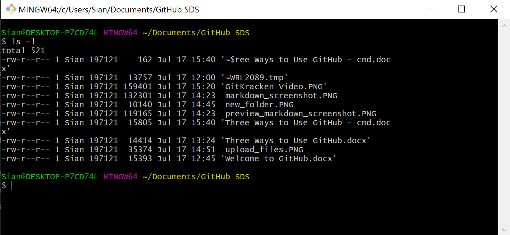

The ls command, however, will only work in a UNIX shell. You can run ls command in Ubuntu and Mac, but not in Windows. In Windows, type dir command instead.
The link to install Git at the start of this document includes **Git Bash**. Git Bash is an application for Microsoft Windows environments which provides an emulation layer (Bash - Unix Shell) for a Git command line.

Use the "touch" command to create an empty file. For example:

```
# Create a empty html file
touch filename.html

# You can specify more filenames, as follows, to create multiple files at once.
touch file.html style.html readme.txt
```

### Command Line Syntax

In working with the command line (terminal) there are few important things that you need to know. In this guide each new line designates a *command line* that should be entered in the terminal. New lines are also sometimes designated with a chevron (>) or dollar sign ($). Exactly how this is written will depend on the guide you are looking at and the operating system you are working with.
```
> This is one line of code
> This is a second
This is a third
$ This is a fourth
```
After each command line you need to press Enter (or Return) in order to execute it.
On the command line (terminal) on your machine, the text before the $ or > is the user, Computer Name (after @) and (often) the directory that you are currently working in. The commands are typed after the > or $. In the example below BrookeSJ is the user and MY470 is the folder. Notice that slashes go in different directions in Windows, **but not in a Git Bash shell**.
```
# Windows
C:\Users\BrookeSJ\Documents\MY470>

# Mac
BrookeSJ-MacBook-Pro: ~Documents/MY470$

# Bash Shell (MING64 stands for Minimalist GNU for Windows)
BrookeSJ@LSELaptop MING64 ~/BrookeSJ/Documents/MY470$
```
You will encounter errors if you use folder names with spaces in them as this will be read as two separate arguments in the command line. If you have spaces in you folder name, you can rename the folder/file in the usual way (i.e. using file explorer) or you can wrap the file name in quotation marks or inverted commas in the specified directory.
```
# This won’t work
cd users/sian brooke/programs

# This will work
cd "user/sian brooke/programs"
```
When using git from the command line, you also need to start each command with the word “git” so the computer knows it is meant to be using git. Just putting “pull” or “push” etc. will result in an error

``` bash
git pull
git status
git clone
```

### Configuring Git
**Read: Telling git/GitHub who you are**

When you start working with git on the command line, you might recive the message "\*\*\*Please tell me who you are.". This slightly odd meseage is just git asking for your GitHub credentials so that you can login and uploaded (push) changes to the right location, with the appropiate permissions. **If you run the commands below, you will only need to configure the details for git once.**

``` bash
git config --global user.email "insert your GitHub email here"
git config --global user.name "insert you GitHub user name here"

# So for me, this would look like:
git config --global user.email s.j.brooke@lse.ac.uk
git config --global user.name SianJMBrooke
```
**Remember if there are spaces in your username you need to wrap it in speech marks**. SO if my user name was *Sian Brooke* I was need to write the user.name as detailed below, other wise each word will be understoond by git as seperate arguements.

``` bash
git config --global user.email s.j.brooke@lse.ac.uk
git config --global user.name "Sian Brooke"
```


## 2. Cloning a Existing Repository
**Read: Downloading Github Repo to my Computer**

Cloning a repository pulls down a full copy of all the repository data that GitHub has at that point in time, including all versions of every file and folder for the project. At any point, you can push your changes to the remote repository on GitHub, or pull other people's changes from GitHub. For more information, see "Working From Your Local Computer" below.

On GitHub, navigate to the main page of the repository. 

Above the list of files, click "⬇️ Code".

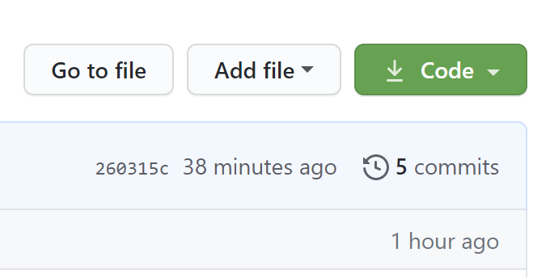

To clone the repository using HTTPS, under "Clone with HTTPS", click 📋. To clone the repository using an SSH key, including a certificate issued by your organization's SSH certificate authority, click **Use SSH**, then click 📋.


Open Git Bash and change the current working directory to the location where you want the cloned directory (**cd**).

Type **git clone**, and then paste the URL you copied earlier. Then press Enter to create your local clone.

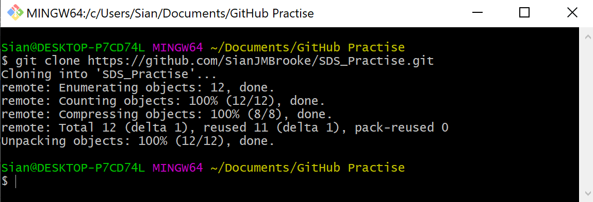

These files should now be copied to your local directory (folder).

## 3. Working From Your Local (Personal) Computer
### Creating a Repo
When creating a new project on your local machine using git, you'll first create a new repository (repo). *This is different to copying a exisiting project to your machine, which we will go through later.*
 
To begin, open up a terminal and move to where you want to place the project on your local machine using the cd (change directory) command detailed above.

To initialize a git repository in the root of the folder, run the **git init** command.

> Git init using the cmd line
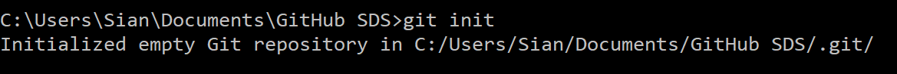

### Add a New File to the Repo

You can open the terminal (command line) and navigate to the directory you want to push to GitHub using the **cd** command we explored in the first section. Another way to do this is to navigate to the *folder which contains* the files you would like to push, bringing up the *context menu* and select "Git Bash" or "Git Bash Here", depending on your version.

> Remember that you need to open the context menu for the folder that contains the files you want to push to GitHub, NOT inside the folder itself.

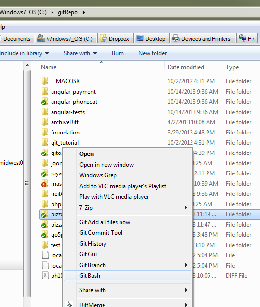

Once your in the correct location you are ready to push this changes to GitHub.

Once you've added or modified files in a folder containing a git repo, git will notice that changes have been made inside the repo. But, git won't officially keep track of the file (that is, put it in a commit - we'll talk more about commits next) unless you explicitly tell it to.

> Git init using the bash shell
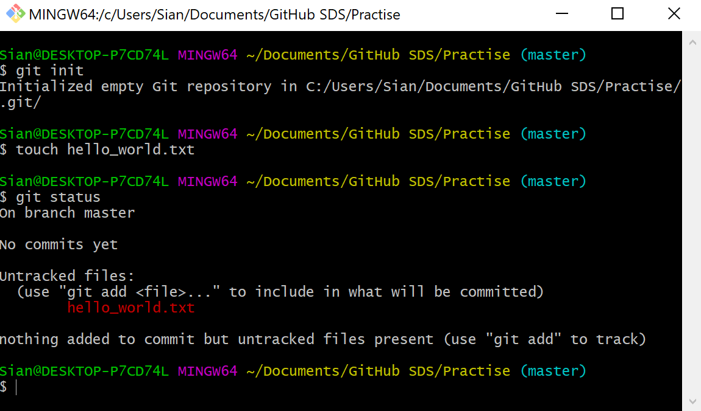

After creating the new file, you can use the git status command to see which files git knows exist.

What this basically says is, "Hey, we noticed you created a new file called hello_world.txt, but unless you use the 'git add' command we aren't going to do anything with it."

### Git Commits and Staging
One of the most confusing parts when you're first learning git is the concept of the staging environment and how it relates to a commit.

A commit is a record of what files you have changed since the last time you made a commit. Essentially, you make changes to your repo (for example, adding a file or modifying one) and then tell git to put those files into a commit.

**Commits make up the essence of your project and allow you to go back to the state of a project at any point.**

So, how do you tell git which files to put into a commit? This is where the staging environment or index come in. As seen above, when you make changes to your repo, git notices that a file has changed but won't do anything with it (like adding it in a commit).

To add a file to a commit, you first need to add it to the staging environment. To do this, you can use the git add <filename> command (see below).

Once you've used the git add command to add all the files you want to the staging environment, you can then tell git to package them into a commit using the git commit command. 


### Add a File to the Staging Environment
Add a file to the staging environment using the "git add" command. 

If you rerun the git status command, you'll see that git has added the file to the staging environment (notice the "Changes to be committed" line).  

> Git add command in Git Bash
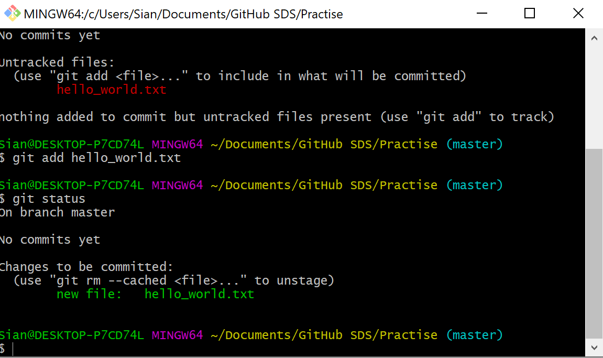

**To commit all files use "git add ."**

### Create a Commit
It's time to create your first commit! Run the command: git commit -m "Your message about the commit"
> Commiting a file
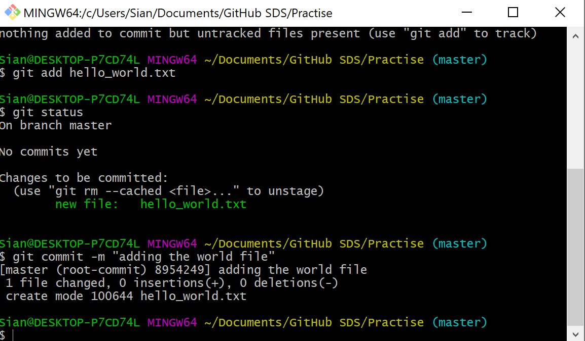

The message at the end of the commit should be something related to what the commit contains - maybe it's a new feature, maybe it's a bug fix, maybe it's just fixing a typo. Don't put a message like "asdfadsf" or "foobar" or even "FINALLY finish it". **That makes the other people who see your commit (and future you) sad. Very, very, sad.**

### Pushing to GitHub

Once you have commited your changede you are ready to **Push** all of your changes to GitHub! Note that if you have followed the steps above you do not need to repeat the commands, you only need to type **git push** and press enter.

```bash
cd Path/to/directory
git add .
git commit -m 'Submitting assignment'
git push
```
After the push command, all of your files will have been uploaded to GitHub. You can check this has worked by looking at the **"Contribution Activity"** on your GitHub Profile.

> GitHub Profile: Contribution Activity
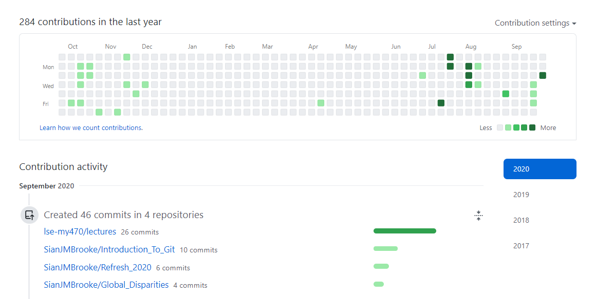


## 4. Creating a New Repo on GitHub

If you only want to keep track of your code locally, you don't need to use GitHub. But if you want to work with a team, you can use GitHub to collaboratively modify the project's code.

To create a new repo on GitHub, log in and go to the GitHub home page. You should see a green "+" and then click "New repository" button.

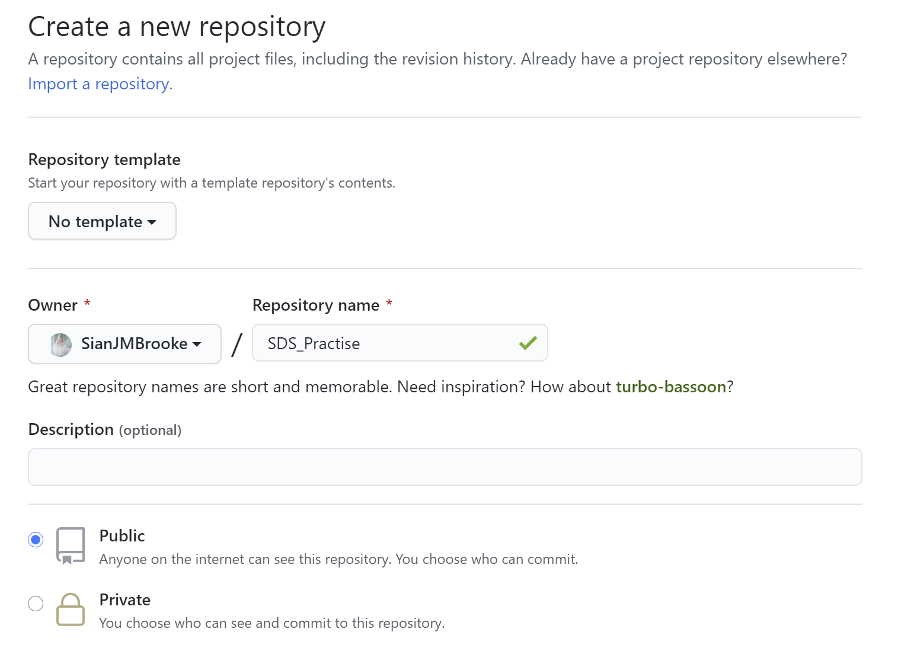

When you're done filling out the information, press the "Create repository" button to make your new repo.

GitHub will ask if you want to create a new repo from scratch or if you want to add a repo you have created locally. In this case, since we've already created a new repo locally, we want to push that onto GitHub so follow the "....or push an existing repository from the command line" section.


## 5. Working with Branches
Now that you've made a new commit, let's try something a little more advanced.

Say you want to make a new feature but are worried about making changes to the main project while developing the feature. This is where *git branches* come in. 

Branches allow you to move back and forth between "states" of a project. For instance, if you want to add a new page to your website you can create a new branch just for that page without affecting the main part of the project. Once you're done with the page, you can merge your changes from your branch into the master branch. When you create a new branch, Git keeps track of which commit your branch 'branched' off of, so it knows the history behind all the files. 

Let's say you are on the master branch and want to create a new branch to develop your web page. Run: "git checkout -b <my branch name>". 
This command will automatically create a new branch and then "check you out" on it, meaning git will move you to that branch, off of the master branch.

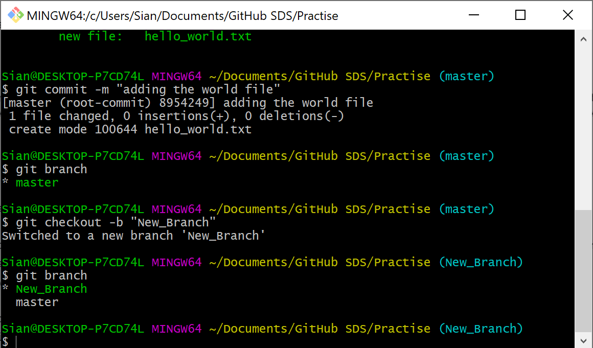

After running the above command, you can use the git branch command to confirm that your branch was created. 

You can change to a branch that already exists using: "git checkout <my branch name>".

The branch name with the asterisk next to it indicates which branch you're pointed to at that given time. 

If you switch back to the master branch and make some more commits, your new branch won't see any of those changes until you merge those changes onto your new branch.

### Push a Branch to GitHub
Now we'll push the commit in your branch to your new GitHub repo. This allows other people to see the changes you've made. If they're approved by the repository's owner, the changes can then be merged into the master branch.

To push changes onto a new branch on GitHub, you'll want to run "git push origin <my branch name>". GitHub will automatically create the branch for you on the remote repository.

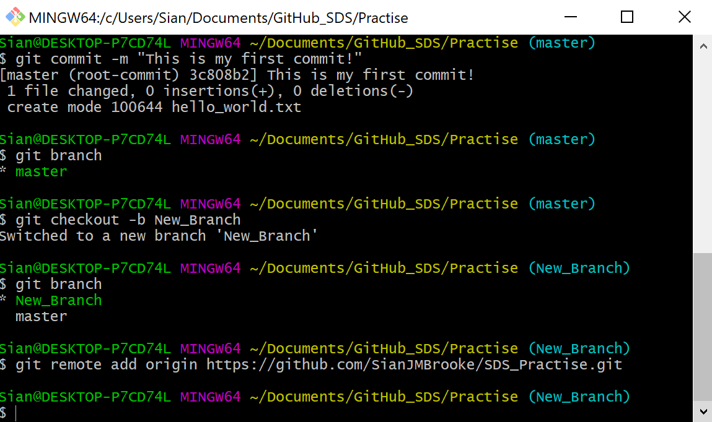

You might be wondering what that "origin" word means in the command above. What happens is that when you clone a remote repository to your local machine, git creates an alias for you. In nearly all cases this alias is called "origin." It's essentially shorthand for the remote repository's URL. So, to push your changes to the remote repository, you could've used either the command: "git push git@github.com:git/git.git yourbranchname" or "git push origin yourbranchname"

*If this is your first time using GitHub locally, it might prompt you to log in with your GitHub username and password. Even if you get this log in wrong the first time (like below) you will be prompted again.*

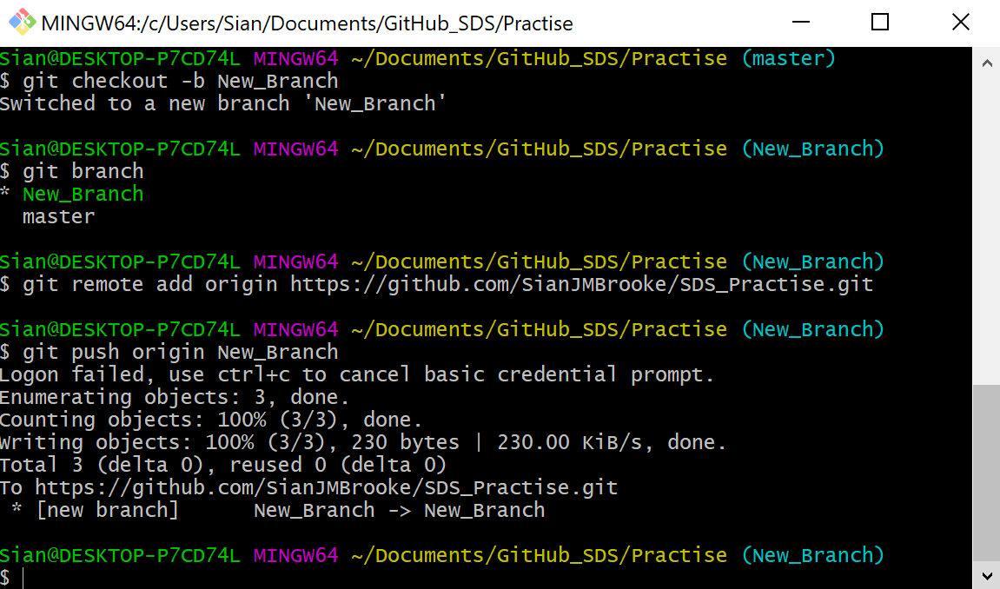

If you refresh your GitHub page, you'll see note saying a branch with your name has just been pushed into the repository. You can also click the "branches" link to see your branch listed there.

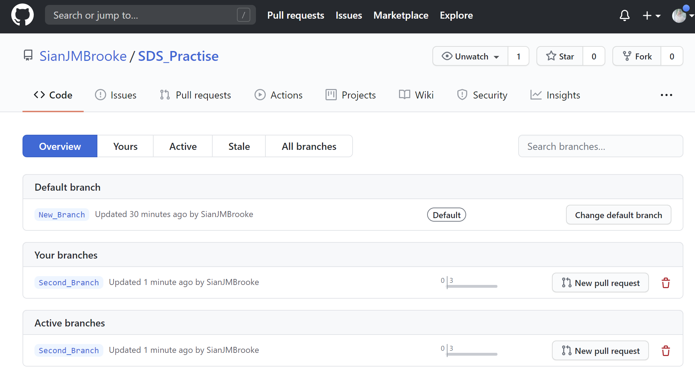

###  Create a Pull Request

A pull request (or PR) is a way to alert a repo's owners that you want to make some changes to their code. It allows them to review the code and make sure it looks good before putting your changes on the master branch.

In the image below we can see what the PR page looks like before you've submitted it.

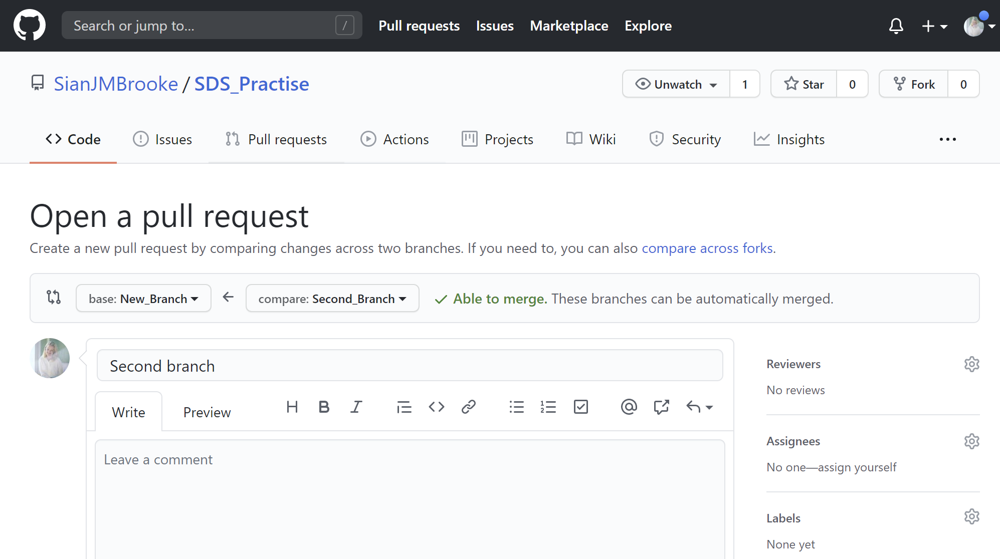

You might see a big green button at the bottom that says "Merge pull request". Clicking this means you'll merge your changes into the master branch.

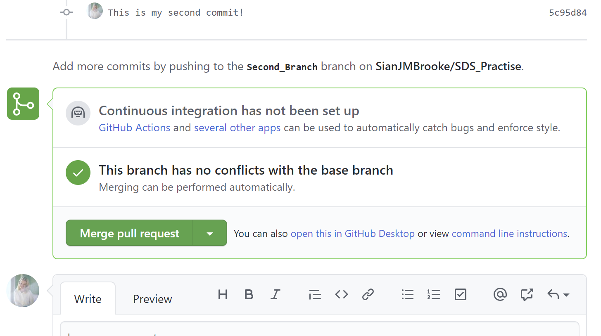

Note that this button won't always be green. In some cases it'll be grey, which means you're faced with a **merge conflict**. This is when there is a change in one file that conflicts with a change in another file and git can't figure out which version to use. You'll have to manually go in and tell git which version to use.

Even in you are the owner of a repo, it's still a good idea to make a PR so you can keep a more complete history of your updates and to make sure you always create a new branch when making changes.

### Merge a PR
When you click the green "Merge pull request" button. This will merge your changes into the master branch.

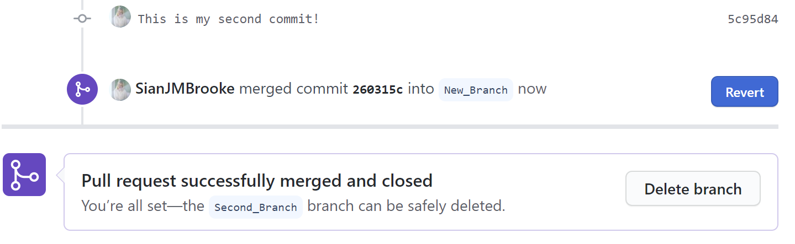

When you're done, I recommend deleting your branch (too many branches can become messy), so hit that grey "Delete branch" button as well. You can double check that your commits were merged by clicking on the "Commits" link on the first page of your new repo.

In the merge screen shot You can also see the hash code of the commit on the right hand side (*260315c*). A hash code is a unique identifier for that specific commit. It's useful for referring to specific commits and when undoing changes (use the git revert <hash code number> command to backtrack).
 
 ### Get changes on GitHub Back to Your Computer

Right now, the repo on GitHub looks a little different than what you have on your local machine. For example, the commit you made in your branch and merged into the master branch doesn't exist in the master branch on your local machine.

In order to get the most recent changes that you or others have merged on GitHub, use the **git pull** (when working on the master branch) in our case **git pull origin New_Branch**.

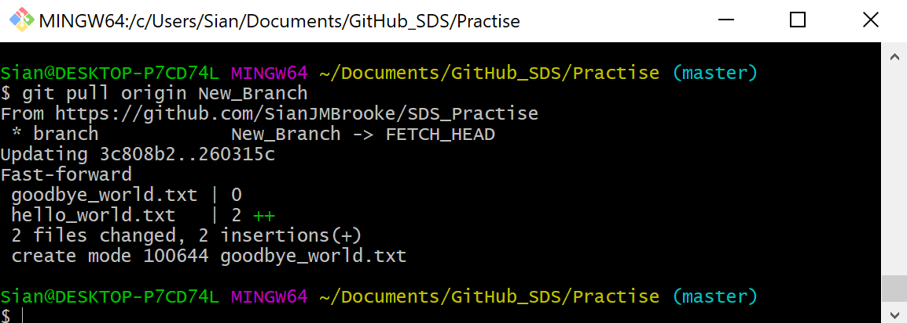

This shows you all the files that have changed and how they've changed.

Now we can use the **git log** command again to see all new commits.

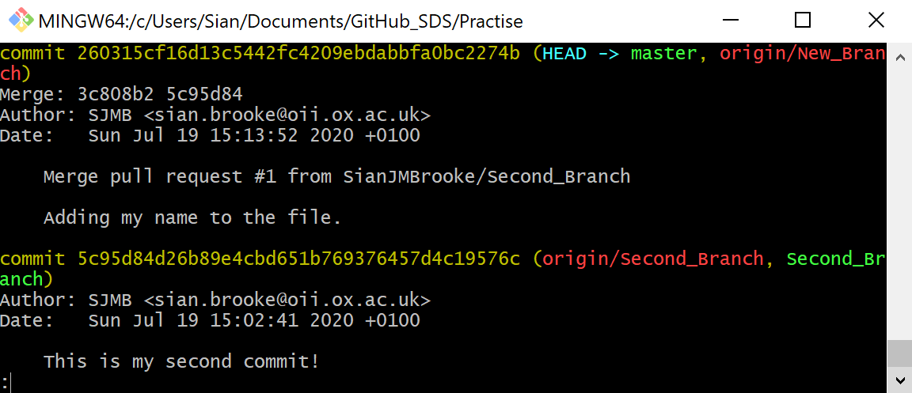

### Congratulations! You now know how to use GitHub!
