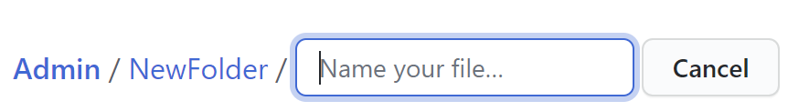
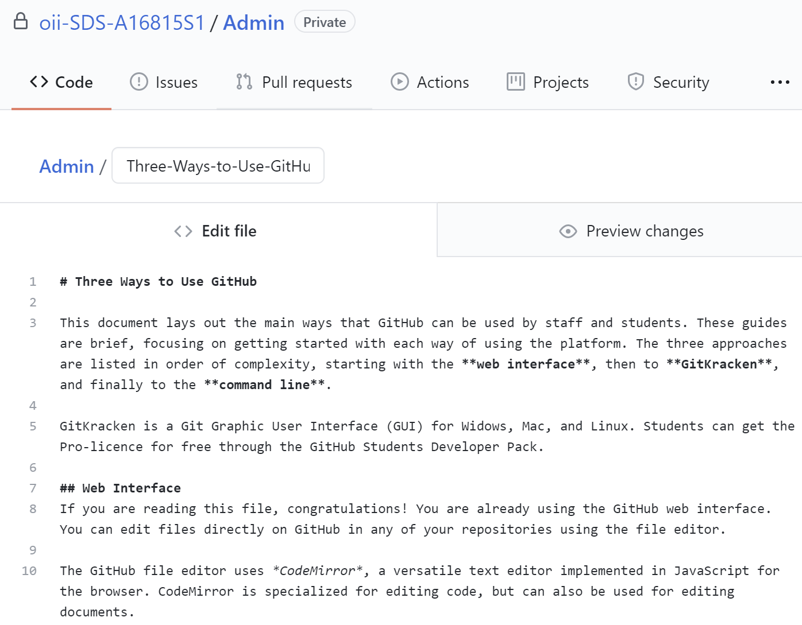
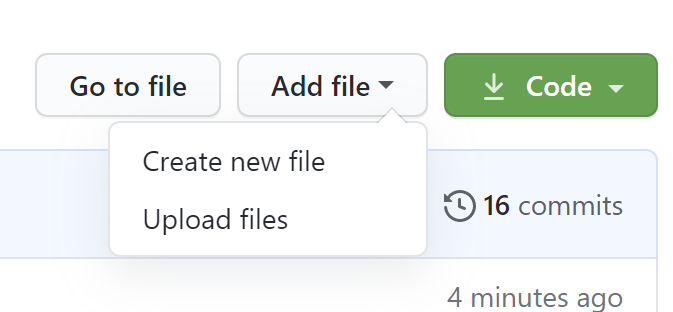

# Three Ways to Use GitHub: Web Interface

This document lays out the main ways that GitHub can be used by staff and students. These guides are brief, focusing on getting started with each way of using the platform. The three approaches are listed in order of complexity, starting with the **web interface**, then to **GitKracken**, and finally to the **command line**. 

GitKracken is a Git Graphic User Interface (GUI) for Widows, Mac, and Linux. Students can get the Pro-licence for free through the GitHub Students Developer Pack.

## Web Interface
If you are reading this file, congratulations! You are already using the GitHub web interface. You can edit files directly on GitHub in any of your repositories using the file editor. 

The GitHub file editor uses *CodeMirror*, a versatile text editor implemented in JavaScript for the browser. CodeMirror is specialized for editing code, but can also be used for editing documents. 

### Creating/Editing Documents Directly
There are two types of documents which can be easily edited directly on GitHub: *Plain text and mark down*. 

#### Types of Documents
**.txt** files are plain text, which you can type directly into. Plain text files do not have wrapping (automatic new lines) or formatting options, so are limited in what they can do. These plain text files are mostly used for licencing. 

**.md** files are markdown, you can also type directly into these files, but they are more flexible with formatting. Markdown is a language that you can use to add formatting elements to plaintext text documents. It can be as simple as adding double asterix (**) either side of the text to make it bold, or hashes (#) to make it a heading.

If you do not add ".md" file extension to the name of the file/document, then the formatting won't render (the formatting won't appear). This document is written is markdown, which is how I was able to have headings, bold/italic text, and images.

Basic Markdown: https://docs.github.com/en/github/writing-on-github/basic-writing-and-formatting-syntax

#### How to Create/Edit Documents
You can add a document directly to a repository by clicking the “Add file” drop down menu, and clicking “Create new file”. This will open up a page which asks you to name your file and you can begin writing your text. You can choose the appropriate file extension to control if the file is plain text (*.txt) or mark down (*.md). 

> Add New Folder



You can add the file into a new subdirectory by adding a folder name in front of the file, in the same manner as a filepath. As shown above.

> Markdown Screenshot



There are two tabs on this file page: “< > Edit new file” and “👁️ Preview”. In the edit tab you can directly type your text, including mark down syntax. In the preview tab you can see how the text renders (how it will appear on GitHub). 

> Markdown Preview Screenshot


If editing an existing document, amendments will appear in the preview tab in a similar way to Tracked Changes in Microsoft Word – For instance, deleted text with be red and strike through and new line additions are green.

Once you have finished editing your file, you need to commit it in order to save your changes. At the bottom of the page is a text box with the header “Commit new file”. Here you can choose to *Commit directly to the master branch* or *Create a new branch for this commit and start a pull request*. In general, you want to commit to the master branch for the sake of simplicity.

### Adding Media to Markdown
Adding **images** to markdown documents is reasonably simple and uses html tags. You can control the size of the images using the *height* argument, the numbers here should be inputted in quotation marks as a string. The location of the image (URL or local path as shown below) is put in the  tag.
``` 

 ``` 
Adding **code** to markdown is slightly more involved. You can create *fenced code blocks* by placing triple backticks (\`\`\`) before and after the code block. GitHub recommend placing a blank line before and after code blocks to make the raw formatting easier to read.

```
# For each row in the column,
for row in df['coursework_score']:
    # if more than a value,
    if row > 50:
        # Append a letter grade
        grades.append('Pass')
    # else, if more than a value,
    elif row > 70:
        # Append a letter grade
        grades.append('first')
```

You can add an optional language identifier to enable syntax highlighting in your fenced code block. For example, to syntax highlight python code would be "\`\`\` python":

``` python
# For each row in the column,
for row in df['coursework_score']:
    # if more than a value,
    if row > 50:
        # Append a letter grade
        grades.append('Pass')
    # else, if more than a value,
    elif row > 70:
        # Append a letter grade
        grades.append('first')
```
Read more on formatting code: https://docs.github.com/en/github/writing-on-github/creating-and-highlighting-code-blocks

### Uploading Files
Files and folders can also be directly uploaded to GitHub, as the platform supports many different file type. This is done in the same way here as on other cloud storage platform. Just navigate to the “Add file” drop down menu and select “Upload file”. Select the file(s) you would like to upload, and commit the changes using the options at the bottom of the page.



**The GitHub Help Pages have more information: https://docs.github.com/en**


