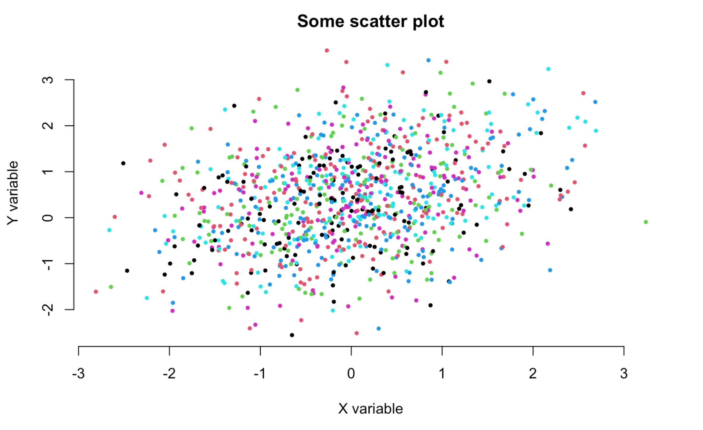

<style>
pre {
  font-size: 16px;
  padding: 6px 6px 6px 12px;
  line-height: 24px;
  margin-bottom: 6px;
  width: 100%;
  left: 0px;
}
</style>

## Outline

1. Introduction
2. Fundamentals and data structures
3. Control flow
4. Functions
5. Reading data and plotting
6. Resources


## R in a Nutshell

- Open source programming language under [GPL][GPL]
- Inspired by the programming language [S][S]
- Useful for statistics and data science, graphics, network analysis, machine learning, web scraping, general purpose programming...
- Superior (if not just comparable) to commercial alternatives. R has over 10,000 user contributed packages (CRAN) and many more elsewhere
- Available on all platforms
- Object oriented, but at its core a functional language
- Interpreted — can be run interactively or as scripts

[S]: https://en.wikipedia.org/wiki/S_(programming_language)
[GPL]: https://www.gnu.org/licenses/gpl.html


## Installing R and RStudio

- R 4.3.2 – Install from https://www.r-project.org/
- RStudio – Install afterwards from https://www.rstudio.com/products/rstudio/download/


## Running R Interactively: RStudio (Preferred)

- IDE (Integrated Development Environment) that makes many things easier
- [R Markdown](https://rmarkdown.rstudio.com/) is the R equivalent to Jupyter Notebooks

```{r, out.width = "70%", fig.align="center", echo = FALSE}
knitr::include_graphics("figs/RStudio.png")
```


## Running R Interactively: VS Code

- Install the R extension in VS Code
- You may also be prompted to install an R package "languageserver"
- Note that currently VS Code is not as well integrated with R Markdown as RStudio


## Installing and Managing Packages in R

- R has over 10,000 user-contributed packages on CRAN (The Comprehensive R Archive Network) and many more elsewhere

- CRAN "is a network of ftp and web servers around the world that store identical, up-to-date, versions of code and documentation for R", see [CRAN](https://cran.r-project.org/)

- To install a package, run directly in R `install.packages("packagename")` (similar to `pip install` and `conda install`, which you run from the terminal, however) 

- To load a package, include `library("packagename")` at the beginning of your script (similar to `import`)

## Fundamentals and Data Structures

- Basic operations in R

- Objects in R

- Key data structures

  - Atomic vectors
  
  - Lists
  
  - Matrices and data frames

## Operators and Mathematical Functions {.smaller}

| **Python**    | **R**         |
|:-------------:|:-------------:|
| `+`           |    `+`        |
| `-`           |    `-`        |
| `/`           |    `/`        |
| `*`           |    `*`        |
| `**`          |    **`^`**    |

<br>

```{r, eval=FALSE}
log(<number>)
exp(<number>)
sqrt(<number>)
mean(<numbers>)
sum(<numbers>)
```

## Logical Operators {.smaller}

| **Python**    | **R**         |
|:-------------:|:-------------:|
| `<`           |    `<`        |
| `>=`          |    `>=`       |
| `==`          |    `==`       |
| `!=`          |    `!=`       |
| `and`         |    **`&`**    |
| `or`          |    **`|`**    |
| `in`          |    **`%in%`** |


## Object Assignment

- The assignment operator in R is `<-`
    
- Assigns values on the right to objects on the left. Mostly similar to `=` but subtle differences. Use `<-` in R

- The `<-` notation also emphasises that `=` is not a mathematical equal sign when using it for assignments in programming, e.g.,`x = x + 1` ?

```{r}
my_object <- 10
print(my_object)
```

```{r}
my_other_object <- 4
print(my_object - my_other_object)
```


## Mutable/Immutable Objects and Memory Allocation

- A way to think about mutable vs immutable object is whether they are copied to a new address in memory when modified or kept in their old one

- Unlike in Python, most objects in R are copied when modified (with some important exceptions), so can be called immutable in that sense

- An exception would for example be a vector that has only been assigned to a single name, it can be modified in place

- It can pay off to study these topics for performance of code regardless of the language. A very good summary for R, which is also the basis of this slide and the next two, can be found here: https://adv-r.hadley.nz/names-values.html

## Mutable/Immutable Objects

```{r, message = FALSE}
library(pryr)
x <- c(3, 6, 9)
x
y <- x
address(x)
address(y)
```

## Mutable/Immutable Objects

```{r, message = FALSE}
x[2] <- 4
x
address(x)
address(y)
```

<br>

- Can check this in Python as well with `id()`:

```{Python}
# Mutable          # Immutable
a = [1,2,3]        b = 42
id(a)              id(b)
a[2] = 4           b += 1
id(a)              id(b)
```


## Querying Object Attributes

```{r}
y <- 10       # For example a numeric vector of length 1
class(y)      # Class of the object
typeof(y)     # R's internal type for storage
length(y)     # Length
attributes(y) # Metadata (matrices e.g. store their dimensions)
names(y)      # Names
dim(y)        # Dimensions
```


## Viewing Objects in Your Global Environment and Removing Them

- List objects in your current environment

```{r, eval = TRUE}
x <- 5
ls()
```

<br>

- Remove objects from your current environment

```{r, eval = TRUE, echo = TRUE}
rm(x)
ls()
```

```{r, eval = FALSE}
rm(list = ls())    # Remove all
```


## Common Data Structures in R

| Dimension | Stores homogenous elements | Stores heterogenous elements |
|:----------|:---------------------------|:-----------------------------|
| 1D        | Atomic vector     |      **List**     |
| 2D        | Matrix            |      **Data frame**     |
| nD        | Array             |                   |

<br>

http://adv-r.had.co.nz/Data-structures.html

More extensive lists e.g. here: https://cran.r-project.org/doc/manuals/r-release/R-lang.html


## Comparison of Python and R {.smaller}


| **Python class** |  **Closest R class** |
|:-----------------|:------------|
| bool             |    logical   |
| int              |    numeric: integer   |
| float            |    numeric: double   |
| str              |    character  |
| list             |    unnamed list     |
| dict             |    named list (named vector also has key-value structure but can only store one type) |
| tuple            |       -      |
| set              |       -      |


## Vectors in R

- Atomic vectors
- Lists (sometimes called recursive vectors)

## Atomic vectors

- An (atomic) vector is a collection of entities which all share the same type
- Vectors are the most common and basic data structure in R

Six types (excluding `raw` and `complex` for this lecture)

- character
- integer
- double
- logical

Integer and double vectors are called numeric vectors

https://r4ds.had.co.nz/vectors.html

## Types

| Example       | Type      |
| :------------ | :-------- |
| `"a"`, `"swc"`    | character |
| `2L` (Must add a `L` at end to denote integer) | numeric: integer |
| `2`, `15.5`       | numeric: double | 
| `TRUE`, `FALSE` | logical |


## Special values

- Integers have one special value: `NA`
- Doubles have four: `NA`, `NaN`, `Inf` and `-Inf`

`Inf` is infinity. You can have either positive or negative infinity

```{r, eval = TRUE}
1 / 0
```

`NaN` means Not a number. It is an undefined value

```{r, eval = TRUE}
0 / 0
```

## Examples 

Use the `c()` function to concatenate observations into a vector

- Character vector

```{r}
char_vec <- c("hello", "world")
print(char_vec)
```

- Numeric (integer) vector

```{r}
num_double_vec <- c(5, 4, 100, 7.65)
print(num_double_vec)
```

- Logical vector

```{r}
logical_vec <- c(TRUE, FALSE, TRUE)
print(logical_vec)
```

## Everything in R Is a Vector!

- The following two objects are identical in R: scalars are vectors of length one here!

```{r}
identical(1.41, c(1.41))
```


## Empty Vectors

- You can create an empty vector with `vector()` (by default the mode is `logical`, but you can define different modes as shown in the examples below)
- It is more common to use direct constructors such as `character()`, `numeric()`, etc.

```{r, eval = TRUE}
vector()
vector(mode = "character", length = 10) # with a length and type
character(5) # character vector of length 5, also see numeric(5) and logical(5)
```


## Add Elements to Vectors

```{r, eval = TRUE}
z <- c("my470", "is")
z <- c(z, "fantastic")
z
```

## Create Vectors with Sequences of Numbers

```{r, eval = TRUE}
series <- 1:10
series
series <- seq(1, 10, by = 0.1)
series
class(series)
```

## Index Elements

- **R indices start at 1**
- **R slices include the last element**
- So `myvector[1:3]` selects 1st, 2nd, and 3rd elements in R
- In Python, it should be `mylist[0:3]` 


## Implications for Indexing Characters

- In Python:

```{Python}
letters = "abcdefghijklmnopqrztuv"
print(letters[0:4])
```

- In R, however, even a single string is a character vector of length one
- Hence, we cannot index individual character elements of a string in R like this

```{r}
firstletters <- "abcdefg"
firstletters[1:4]
```


## Implications for Indexing Characters

- Instead, use specialized functions

```{r}
substr(firstletters, 1, 3)   
```

- To determine length of a string, e.g. use `nchar`

```{r}
length("London")
nchar("London")
```


## Vector Subsetting in R

- To subset a `vector`, use square parenthesis to index the elements you would like via `object[index]`.

- Numerical subsetting

```{r}
num_double_vec[3]
num_double_vec[1:2]
```


## Vector Subsetting in R

- Subsetting with names

```{r}
x <- c(1, 2, 4)
names(x) <- c("element1", "element2", "element3")
x["element1"]
```

Caveat: Although this looks somewhat like a Python dictionary, recall that vectors can only store single types

## Vector Subsetting in R

- Logical subsetting

```{r}
char_vec <- c("hello", "world")
char_vec
logical_vec <- c(TRUE, FALSE)
logical_vec
char_vec[logical_vec]
```

## Vector Operations

- In R, mathematical operations on vectors typically occur **element-wise** (unless you, e.g., specify a dot-product with `%*%`)

```{r}
fib <- c(1, 1, 2, 3, 5, 8, 13, 21)
fib[1:7] + fib[2:8]
```

- It is also possible to perform logical operations on vectors

```{r}
fib <- c(1, 1, 2, 3, 5, 8, 13, 21)
fib_greater_five <- fib > 5
print(fib_greater_five)
```


## Recycling

- R usually operates on vectors of the same length
- If it encounters two vectors of different lengths in a binary operation, it _replicates_ (recycles) the smaller vector until it is of the same length as the longer vector
- Afterwards it does the operation
- Related to "broadcasting" in numpy
- Often helpful, but can lead to very hard to find bugs

## Recycling

- If the recycled smaller vector has to be “chopped off” to make it the length of the longer vector, you will get a warning, but it will still return a result

```{r}
x <- c(1, 2, 3)
y <- c(5, 10)
x * y
```


```{r}
x <- 1:20

x * c(1, 0)    # turns the even numbers to 0
```


## Factors: Vectors with Labels

- A factor is a special kind of vector

- It is similar to a character vector, but each unique element is also associated with a numerical value which allows to better process categorical data

- A factor vector can only contain predefined values

```{r}
factor_vec <- as.factor(c("a", "b", "c", "a", "b", "c"))
factor_vec
as.numeric(factor_vec) # how it is processed in the background
```

- Note: Statistical models can require categorical variables to be stored as factors

## Lists

- Lists are the other type of vector in R. They are sometimes referred to as "recursive vectors" as lists can also contain lists themselves
- In general, however, atomic vectors are commonly called `vectors` in R and lists are called `lists`
- A `list` is a collection of any set of object types
- Closest to the dictionary's key-value structure in Python if elements in the list are named

## Lists

A `list` is a collection of any set of object types

```{r}
my_list <- list(something = num_double_vec, 
                another_thing = matrix(data = 1:9, nrow = 3, ncol = 3), 
                something_else = "my470")
my_list
```


## How to Index List Elements in R

- **Using [**

```{r}
my_list["something_else"]
my_list[3]
class(my_list[3])
```

## How to Index List Elements in R

- **Using [[**

```{r}
my_list[["something"]]
my_list[[1]]
class(my_list[[1]])
```

## How to Index List Elements in R

- **Using $**

```{r}
my_list$another_thing
```

(does not allow multiple elements to be indexed in one command)


## Matrices

- Next, we will discuss tabular data in more detail
- A `matrix` arranges data from a vector into a tabular form, **all elements have to be of the same type**
- `Arrays` have more than 2 dimensions

```{r}
my_matrix <- matrix(data = 1:100, nrow = 10, ncol = 10)
my_matrix
```

## Data Frames

A `data.frame`, in contrast, is a matrix-like R object in which the **columns can be of different types**

```{r}
my_data_frame <- data.frame(numbers = num_double_vec,
                            words = char_vec,
                            logical = logical_vec)
my_data_frame
```

## Matrix and Data Frame Subsetting

- You can subset a `matrix` or `data.frame` with integers referring to rows and columns

```{r}
my_matrix[2, 2]
my_matrix[2:3, 2:3]
my_data_frame[, 1]
```

## Matrix and Data Frame Subsetting {.smaller}

- You can also access rows and columns with names

```{r}
# Adding some column names to the matrix
colnames(my_matrix) = letters[1:10]

# Works for matrices and data frames
my_matrix[, "e"]
my_data_frame[, "numbers"]
my_data_frame[, c("numbers", "words")]

# Works only with data frame columns
my_data_frame$numbers
```

## Matrix and Data Frame Subsetting {.smaller}

- Dropping rows or columns can be done using the `-` operator and integers (in combination with the `c` function if multiple rows are dropped)

```{r}
my_matrix[-4, -5]
```

```{r}
my_matrix[-c(2:8), -c(2:8)]
```

- `2:8` creates a vector of the integers 2, ... , 8 and the `-` operator negates these. We wrap the vector in the `c` function so that `-` applies to each element, and not just the first

## Outline

1. Introduction
2. Fundamentals and data structures
3. **Control flow**
4. Functions
5. Reading in data and plotting
6. Data science workflows with R today

## If-Else Statements

- Using the logical operations discussed before, R has the usual if, if-else, and else conditions
- Contrary to Python, indentation is optional (but advised for readability), and brackets separate parts of the statements

```{r}
x <- 3
if (x > 4) {
  print(24)
} else {
  print(17)
}
```

##  With an Additional `else if` Part


```{r}
x <- 2
y <- 3
if (x < y) {
    print(24)
} else if (x > y) {
    print(18)
} else {
    print(17)
}
```


## For-Loops

- Like conditionals, the different parts of loops are distinguished via brackets rather than mandatory indentation

```{r}
for (i in 1:4) {
    print(i)
}
```

```{r}
character_vector <- c("hello", "world")
for (text in character_vector) {
    print(text)
}
```

## While-Loops

```{r}
x <- 1
while (x < 5) {
    print(x)
    x <- x + 1
}
```


## Improving Efficiency {.smaller}

- Using vectorised operations where possible instead of loops can immensely speed up your code

```{r, eval = FALSE}
# For example:
x <- 1:1000
y <- 1:1000
z <- numeric(1000)
for (i in 1:1000) {
  z[i] <- x[i]*y[i]
}
# vs:
z <- x*y

# Or:
z <- 0
for (i in 1:1000) {
  z <- z + x[i]*y[i]
}
# vs:
z <- x%*%y
```

- Same considerations apply to vectorised operations in `numpy`

- For an in-depth discussion of measuring and improving performance in R: https://adv-r.hadley.nz/perf-measure.html and https://adv-r.hadley.nz/perf-improve.html


## Calling Functions

```{r, eval = FALSE}
function_name(parameter_one, prameter_two, ...)
```

- When a function parameter is not assigned a default value, then it is mandatory to be specified by the user
- Default arguments can be overridden if supplied
- For example, consider the `mean()` function: `mean(x, na.rm = FALSE)`
- This function takes two (main) arguments
   - `x` is a numeric vector
   - `na.rm` is a logical value that indicates whether we'd like to remove missing values (`NA`). `na.rm` is set to `FALSE` by default

```{r, eval = TRUE}
vec <- c(1, 2, 3, NA, 5)
mean(x = vec, na.rm = TRUE)
```

## Defining Functions

- Just like in Python and other programming languages, it is key to create own functions for a modular programme

```{r}
my_addition_function <- function(a = 10, b) {
    return(a + b)
}

my_addition_function(a = 5, b = 50)
my_addition_function(3, 4)
my_addition_function(b = 100)
```

- Notice that, in R, default parameters can come before non-default ones; this is not the case in Python


## Variables in Functions Have Local Scope

```{r}
my_demo_function <- function(a) {
    a <- a * 2
    return(a)
}

a <- 1
my_demo_function(a = 20)
a
```

## The Pipe Operator

- Very often used in R code today
- The pipe operator %>% simply indicates that the previous object is used as the first argument in the subsequent function

```{r, message = FALSE}
library(tidyverse) # pipe operators are originally from the `magrittr` package by Stefan Milton Bache
x <- c(1,2,3,4,15)
mean(x)

# Same but with the pipe operator
x %>% mean()
```


## The Pipe Operator 

- Useful for chains of computations

```{r, message = FALSE}
x <- c("1", "2")
x %>%
  as.numeric() %>% 
  mean() %>% 
  sqrt()

# Easier to read than the equivalent nested functions
sqrt(mean(as.numeric(x)))
```

## Loops Revisited: Apply Functions {.smaller}

- Another very frequently used approach in R is to replace loops with `apply`
- It applies a function to every column, row, element of a vector, list, etc.
- Apply exists in Python too, for example `map()` or `df.apply()` in `pandas`
- The following function avoids having to write a loop over all columns and determining the maximum value in each of them

```{r}
x <- matrix(1:9, nrow = 3, ncol = 3)
x
apply(X = x, MARGIN = 2, FUN = max)
```

- Other options
  - `sapply` to apply function to every element of a vector
  - `lapply` to apply function to every element of list


## Object Oriented Programming in R

- "Everything that exists in R is an object" (John Chambers)

- However, **object oriented programming (OOP)** is much less important in the daily use of R than functional programming

- Functional programming treats computation as the evaluation of mathematical functions avoiding mutable data 

- OOP is also more challenging in R as there are multiple OOP systems called S3, R6, S4, etc.

- If you would like to learn about object oriented programming in R (e.g. to write packages), see [here](https://adv-r.hadley.nz/oo.html)


## Functional Programming and R

- R has plenty of object orientation and classes, but at its core it is more of a functional programming language

Two stylised features of functional programming:

1. First-class functions, i.e. functions that behave like any other data structure. In R, this means that you can do many of the things with a function that you can do with a vector: You can assign them to variables, store them in lists, pass them as arguments to other functions, create them inside functions, and even return them as the result of a function.

2. "Pure" functions: The output only depends on the inputs, i.e. if you call it again with the same inputs, you get the same outputs. The function also has no side-effects, like changing the value of a global variable, writing to disk, or displaying to the screen. So, e.g., `y <- 4; my_function <- function(x) {return(y + x)}` is not a pure function.

Source: https://adv-r.hadley.nz/fp.html


## Functional Programming and R

- Of course not all functions in R always return the same output with the same inputs, e.g., `runif()` depends on the pseudo-random number seed, and `write.csv()` writes output to disk

- Furthermore, Python also has features of both object oriented and functional programming

- Yet, the number of pure functions is arguably higher in R than in some other programming languages


## R vs. Python

- Python, following more the OOP approach, has many methods and attributes attached to objects (recall week 5 on classes)

- For example, consider `R` vs. `pandas` in Python. Let's assume we have some data contained in a data frame object called "df"

- `colnames(df)` vs. `df.columns`

- `nrow(df)` vs. `df.shape[0]`

- `apply(X = df, MARGIN = 2, FUN = max)` vs. `df.apply(func=max, axis=0)`


## Reading and Writing .csv Files

```{r, eval = FALSE}
my_data <- read.csv(file = "my_file.csv")
```
    
- `my_data` is an R data.frame object
- `my_file.csv` is a .csv file with your data
- Might need to use the `stringsAsFactors = FALSE` argument
- In order for R to load `my_file.csv`, it will have to be saved in your current working directory
  - Use `getwd()` to check your current working directory
  - Use `setwd()` to change your current working directory
- Otherwise define the full path to the file

```{r, eval = FALSE}
write.csv(my_data, "my_file.csv")
```


## Creating (Pseudo-)Random Data

```{r, eval = TRUE}
set.seed(123)     # set random seed to get replicable results 
n <- 1000
x <- rnorm(n)     # draw 1000 points from the normal distribution
z <- runif(n)     # draw 1000 points from the uniform distribution
g <- sample(letters[1:6], n, replace = T)   # sample with replacement
# Set some parameters, including noise
beta1 <- 0.5
beta2 <- 0.3
beta3 <- -0.4
alpha <- 0.3
eps <- rnorm(n, sd = 1)
# Generate data that follows a linear trend
y <- alpha + beta1 * x + beta2 * z + beta3 * (x * z) + eps
# Save data in a data frame
my_data <- data.frame(x = x, y = y, z = z, g = g)
```
    

## Plots

- Plots are one of the strengths of R
- There are two main frameworks for plotting

    1. Base R graphics
    2. `ggplot2`

## Base R Plots {.smaller}
    
- The basic plotting syntax is very simple
- `plot(x, y)` will give you a scatter plot

```{r, fig.align = "center", fig.width = 6}
plot(my_data$x, my_data$y)
```


## Improving Base R Plots {.smaller}

- The plot function takes a number of arguments (`?plot` for a full list)

```{r, eval = FALSE}
plot(x = my_data$x, y = my_data$y,
     xlab = "X variable",            # x axis label
     ylab = "Y variable",            # y axis label
     main = "Some scatter plot",     # main title
     pch = 19,                       # solid points
     cex = 0.5,                      # smaller points
     bty = "n",                      # remove surrounding box
     col = as.factor(my_data$g)      # colour by grouping variable
)
```
<br>

```{r, out.width = "40%", fig.align="center", echo = FALSE}

```

# Resources #

## Data Science with R

- MY470 is a course about programming, so we covered fundamentals of the R language in this lecture
- This provided the necessary knowledge for you to use a range of tools in subsequent work
- The following gives an outlook and many links to resources that you can use

## Excellent Books on the R Language

- Programming in R programming

  - _Advanced R_ by Hadley Wickham: https://adv-r.hadley.nz/

- Applied data science in R

  - _R for Data Science_ by Hadley Wickham and Garrett Grolemund: https://r4ds.had.co.nz/

## Data Processing with R

- `tidyverse`: Collection of packages such as `tidyr`, `dyplr`, `ggplot2`, etc.
  - More information: https://www.tidyverse.org/
  - "The tidyverse is an opinionated collection of R packages designed for data science. All packages share an underlying design philosophy, grammar, and data structures."
  - Summary of how to use the `tidyverse` packages in _R for Data Science_: https://r4ds.had.co.nz/
- `data.table`: Particularly fast package to process very large datasets

## Visualisation with R: `ggplot2` {.smaller}

- `ggplot2` is a flexible tool for visualisation

- Book by Hadley Wickham, Danielle Navarro, and Thomas Lin Pedersen: https://ggplot2-book.org

- Great website with `ggplot2` sample code for many different types of plots: https://www.r-graph-gallery.com/ggplot2-package.html

```{r, out.width = "30%", fig.align="center", echo = FALSE}
knitr::include_graphics(c("figs/ggridges.png", "figs/spark_plot_new_trans.png"))
```

## Statistical Machine Learning with R

- Range of packages from LASSO regressions (`glmnet`) to random forest (`randomForest`) or support vector machines (`e1071`)
- Excellent book that describes most key concepts in statistical machine learning: http://faculty.marshall.usc.edu/gareth-james/ISL/

```{r, out.width = "15%", fig.align="center", echo = FALSE}
knitr::include_graphics("figs/isl_cover.jpg")
```

- LSE course **MY474 Applied Machine Learning for Social Science**

## Text Analysis with R

- The `quanteda` package
  - Quickstart: https://quanteda.io/articles/quickstart.html
  - Tutorials: https://tutorials.quanteda.io/ 
- LSE course **MY459 Quantitative Text Analysis**

## Network Analysis

- Packages such as `igraph`
- Book by Douglas A. Luke: https://www.springer.com/de/book/9783319238821
- LSE course **MY461 Social Network Analysis**


