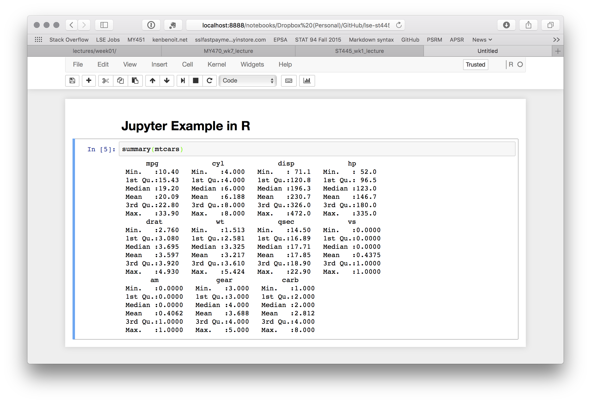

# Introduction to R

## R in a nutshell

R is a versatile, open source programming/scripting language that's useful both for statistics but also data science. Inspired by the programming language [`S`][S].

* Open source software under [GPL][].
* Superior (if not just comparable) to commercial alternatives. R has over 10,000 user contributed packages (CRAN) and many more elsewhere. 
* Available on all platforms.
* Not just for statistics, but also general purpose programming.
* Is object oriented and functional.
* Large and growing community of peers.

[S]: https://en.wikipedia.org/wiki/S_(programming_language)
[GPL]: https://www.gnu.org/licenses/gpl.html


## How to run `R`

You can run `R` interactively or in batch mode.

### Interactive mode*  

e.g. type in `R` from the shell. The window that appears is called the R console. Any command you type into the prompt is interpreted by the R kernel. An output may or may not be printed to the screen depending on the types of commands that you run.

### From the R GUI console 

This is installed when you install R.

### Preferred: RStudio

RStudio is an IDE (Integrated Development Environment) that makes everything fantastically easier.

----

### From Jupyter {.smaller}

You need to change the kernel to R.

```{r, out.width = "100%", echo = FALSE}

```

----

### Terminal {.smaller}

```{r, out.width = "100%", echo = FALSE}

```

----

### Batch mode {.smaller}

You can also run one or more R scripts in batch mode.

```{bash, eval = FALSE}
R CMD BATCH script_1.R script_2.R
```
You can also script inline using `Rscript -e`. 

----

### R GUI Console {.smaller}

```{r, out.width = "100%", echo = FALSE}

```

----

### RStudio {.smaller}

```{r, out.width = "100%", echo = FALSE}

```


## Viewing objects in your global environment and how to clean them up

List objects in your current environment

```{r, eval = FALSE}
ls()
```

remove objects from your current environment

```{r, eval = TRUE, echo = TRUE}
x <- 5
ls()
rm(x)
ls()
```

remove all objects from your current environment

```{r, eval = FALSE}
rm(list = ls())
```

- Notice that we have nested one function inside another.

- Use `#` signs to comment. Comment liberally in your R scripts. Anything to the right of a `#` is ignored by R. 

-  Assignment operator
    
    `<-` is the assignment operator. Assigns values on the right to objects on the left. Mostly similar to `=` but not always. Learn to use `<-` as it is good programming practice. Using `=` in place of `<-` can lead to issues down the line.

## Package management

* `install.packages("package-name")` will download a package from one of the CRAN mirrors assuming that a binary is available for your operating system. If you have not set a preferred CRAN mirror in your `options()`, then a menu will pop up asking you to choose a location.

* Use `old.packages()` to list all your locally installed packages that are now out of date. 
`update.packages()` - will update all packages in the known libraries interactively. This can take a while if you haven't done it recently. To update everything without any user intervention, use the `ask = FALSE` argument.  

```{r, eval = FALSE}
update.packages(ask = FALSE)
```


## Quitting R

type in `quit()` or `q()` and answer `y` to quit.


# R versus Python

## Data Types {.smaller}

| **Python class** | **Immutable** | **Description**                   |  **R class** |
|:-----------------|:-------------:|:----------------------------------|:------------:|
| bool             |      Yes      | Boolean value                     |    logical   |
| int              |      Yes      | integer number                    |    integer   |
| float            |      Yes      | floating-point number             |    numeric   |
| list             |       No      | mutable sequence of objects       |     list     |
| tuple            |      Yes      | immutable sequence of objects     |       -      |
| str              |      Yes      | character string                  |   character  |
| set              |       No      | unordered set of distinct objects |       -      |
| frozenset        |      Yes      | immutable form of set class       |       -      |
| dict             |       No      | dictionary                        | (named) list |


## Indexing {.build}

### R indexes from 1 (not 0)

   - where an index begins counting, when addressing elements of a data object
   - [most languages index from 0](https://en.wikipedia.org/wiki/Comparison_of_programming_languages_%28array%29#Array_system_cross-reference_list)
   - human ages - do they index from 0?
   
### R indexes include the ending index

- so `myvector[1:3]` includes the first, second, and third elements in R
- whereas in Python, `[1:3]` is up to, but not including, the ending element index

### R does not index individual character elements of a string


## Python

```{python}
letters = "abcdefghijklmnopqrztuv"
print letters[0:4]
```

## R

```{r}
letters[1:5]
```

```{r}
firstletters <- "abcdefg"
firstletters[1:3]
```

Why did this happen?


# R Operators

## Basic operations in R

```{r}
1 + 1
5 - 3
6/2
4*4
```

## Basic operations in R

Other typical mathematical functions are also hard-coded:

```{r, eval=FALSE}
log(<number>)
exp(<number>)
sqrt(<number>)
mean(<numbers>)
sum(<numbers>)
```

## Basic operations in R

R also understands logical operators:

- `<` : less than
- `>` : greater than
- `==` : equal to (note, not `=`)
- `>=` : greater than or equal to
- `<=` : less than or equal to
- `!=` : not equal to
- `&` : and
- `|` : or

## R `objects`

- R is an object-oriented programming language
- The entities that R creates and manipulates are known as objects
- These may be variables, arrays of numbers, character strings, functions
- Objects are created using the *assignment operator*: `<-`
- Once created, an object is stored in your current *workspace*

```{r}
my_object <- 10
print(my_object)
```

```{r}
my_other_object <- 4
print(my_object - my_other_object)
```

# Data Structures

## The Importance of Understanding Object Types 

To make the best of the R language, you'll need a strong understanding of the basic data types and data structures and how to operate on those.

It is **critical** to understand because these are the objects you will manipulate on a day-to-day basis in R. Dealing with object conversions is one of the most common sources of frustration for beginners.

> To understand computations in R, two slogans are helpful:
>  - Everything that exists is an object.
>  - Everything that happens is a function call.
 -- _John Chambers_

## Atomic Classes

`R` has 6 (excluding the `raw` class for this workshop) atomic classes.

* character
* numeric (real or decimal)
* integer
* logical
* complex

----

| Example | Type |
| ------- | ---- |
| "a", "swc" | character |
| 2, 15.5 | numeric | 
| 2 (Must add a `L` at end to denote integer) | integer |
| `TRUE`, `FALSE` | logical |
| 1+4i | complex | 


## Data Structures

R has many data structures. These include:

* atomic vector
* list
* matrix
* data frame
* factors
* tables


## `vector` - the basic building block of R

A vector is a collection of entites which all share the same type. 

A vector is the most common and basic data structure in `R` and is pretty much the workhorse of R. Technically, vectors can be one of two types:

* atomic vectors
* lists

We use the `c()` function to concatenate observations into a single vector.

----

### Numeric

```{r}
num_vec <- c(5, 4, 2, 100, 7.65)
print(num_vec)
```

### Character

```{r}
char_vec <- c("apple", "pear", "plumb", "pineapple", "strawberry")
print(char_vec)
```


## Atomic Vectors

A vector can be a vector of elements that are most commonly `character`, `logical`, `integer` or `numeric`.

You can create an empty vector with `vector()` (By default the mode is `logical`. You can be more explicit as shown in the examples below.) It is more common to use direct constructors such as `character()`, `numeric()`, etc.

```{r, eval = TRUE}
x <- vector()
# with a length and type
vector("character", length = 10)
```

----

```{r, eval = TRUE}
vector("character", length = 10)
character(5) ## character vector of length 5
numeric(5)
logical(5)
```


----

Various examples:

```{r, eval = TRUE}
x <- c(1, 2, 3)
x
length(x)
```
`x` is a numeric vector. These are the most common kind. They are numeric objects and are treated as double precision real numbers. To explicitly create integers, add an `L` at the end.

```{r, eval = TRUE}
x1 <- c(1L, 2L, 3L)
```

----

You can also have logical vectors. 

```{r, eval = TRUE}
y <- c(TRUE, TRUE, FALSE, FALSE)
```

Finally you can have character vectors:

```{r, eval = TRUE}
z <- c("Ken", "Milena", "Kohei", "Christian")
z
```


## Examine your vector

```{r, eval = TRUE}
typeof(z)
length(z)
class(z)
str(z)
```

Question: Do you see a property that is common to all these vectors above?


## Adding elements

```{r, eval = TRUE}
z <- c(z, "Annette")
z
```

## More examples of vectors

```{r, eval = TRUE}
x <- c(0.5, 0.7)
x <- c(TRUE, FALSE)
x <- c("a", "b", "c", "d", "e")
x <- 9:100
x <- c(1+0i, 2+4i)
```

## You can also create vectors as a sequence of numbers

```{r, eval = TRUE}
series <- 1:10
seq(10)
seq(1, 10, by = 0.1)
```

## Other objects {.build}

`Inf` is infinity. You can have either positive or negative infinity.

```{r, eval = TRUE}
1/0
1/Inf
```


`NaN` means Not a number. It's an undefined value.

```{r, eval = TRUE}
0/0
```

# Object Attributes and Classes

## Object Attributes

Each object can have attributes. Attribues can be part of an object of R. These include: 

* names
* dimnames
* dim
* class
* attributes (contain metadata)

----

You can also glean other attribute-like information such as length (works on vectors and lists) or number of characters (for character strings). 

```{r, eval = TRUE}
length(1:10)
nchar("London")
```


## Querying object attributes

```{r, eval = FALSE}
typeof()     # what is it?
length()     # how long is it? What about two dimensional objects?
attributes() # does it have any metadata?
```

Many objects have attributes attached to them that are necessary to their definition.

## Example: `matrix`

A `matrix` object in R is simply a vector with row and column attributes.
```{r}
m <- matrix(1:6, nrow = 2)
m
attributes(m)
```

## Example

```{r}
x <- "dataset"
typeof(x)
attributes(x)

y <- 1:10
typeof(y)
length(y)
```

----

```{r}
attributes(y)

z <- c(1L, 2L, 3L)
typeof(z)
```

## Brief introduction to class methods in R {.build}

```{r}
mychar <- "Hello World"
methods(class = class(mychar))
```


### Equivalent in Python: {.small}

```{python tidy = TRUE, tidy.opts=list(width.cutoff=60)}
mystring = "Hello World"

print dir(mystring)
```


## Factors: Vectors with labels

A factor is similar to a character vector, but here each unique element is associated with a numerical value which represents a category:

```{r}
fac_vec <- as.factor(c("a", "b","c","a","b","c"))
fac_vec
as.numeric(fac_vec)
```

# Vectorized operations

## `vector` subsetting

To subset a `vector`, use square parenthesis to index the elements you would like via `object[index]`:

- Numerical subsetting

```{r}
char_vec
char_vec[1:3]
```

## `vector` subsetting

- Logical subsetting

```{r}
logical_vec <- c(TRUE, FALSE, FALSE, TRUE, FALSE)
logical_vec
char_vec[logical_vec]
```

## `vector` operations

In R, mathematical operations on vectors occur elementwise:

```{r, echo = F}
fib <- c(1, 1, 2, 3, 5, 8, 13, 21)
```

```{r}
fib <- c(1, 1, 2, 3, 5, 8, 13, 21)
fib[1:7]
fib[2:8]
fib[1:7] + fib[2:8]
```

## Recycling

R likes to operate on vectors of the same length, so if it encounters two vectors of different lengths in a binary operation, it _replicates_ (recycles) the smaller vector until it is the same length as the longest vector, then it does the operation.

If the recycled smaller vector has to be “chopped off” to make it the length of the longer vector, you will get a warning, but it will still return a result:

```{r}
x <- c(1, 2, 3)
y <- c(1, 10)
x * y
```

## (recyling continued)

Recycling occurs in other contexts too:  

*   With mathematical operators (as above)  
*   Whenever two or more vectors get operated on elementwise, not just with comparison operators  
*   With indexing operators when indexing by logical vectors  

----

```{r}
x <- 1:20

x * c(1, 0)    # turns the even numbers to 0

x * c(0, 0, 1) # turns non-multiples of 3 to 0

x < ((1:4)^2)  # recycling c(1, 4, 9, 16)
```

## `vector` operations

It is also possible to perform logical operations on vectors:

```{r}
fib <- c(1, 1, 2, 3, 5, 8, 13, 21)
fib_greater_five <- fib > 5
print(fib_greater_five)
```

And we can combine logical operators
```{r}
fib_greater_five_less_two <- fib > 5 | fib < 2
print(fib_greater_five_less_two)
```


## `matrix`

A matrix is just a collection of vectors! I.e. it is a multidimensional vector where all elements are of the same type

```{r}
my_matrix <- matrix(data = 1:100, nrow = 10, ncol = 10)
my_matrix
```

## `data.frame`

A `data.frame` is a matrix-like R object in which the columns can be of different types

```{r}
my_data_frame <- data.frame(numbers = num_vec, fruits = char_vec, logical = logical_vec)
my_data_frame
```

## `matrix` and `data.frame` subsetting

To subset a `matrix` or `data.frame`, you need to specify both rows and columns:

```{r}
my_matrix[1:3, 1:3]

my_data_frame[1, ]
```

## `matrix` and `data.frame` subsetting

We can also subset to remove rows or columns that we do not want to see by using the `-` operator applied to the `c` function:

```{r}
my_matrix[-c(1:3), -c(1:3)]
```

In the code, `1:3` creates a vector of the integers 1, 2 and 3, and the `-` operator negates these. We wrap the vector in the `c` function so that `-` applies to each element, and not just the first element.

## `list`

A `list` is a collection of any set of object types

```{r}
my_list <- list(something = num_vec, 
                another_thing = my_matrix[1:3,1:3], 
                something_else = "ken")
my_list
```


# Exercise Week 8 Preview

